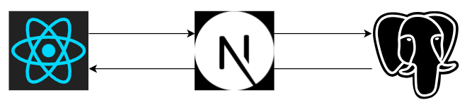

# Diário de bordo
Link no vercel: [diario-de-bordo.vercel.app](https://diario-de-bordo.vercel.app/)

## **1. Objetivo**

O propósito deste documento é definir as necessidades de alto-nível e características do sistema **Diário de bordo**.

## **2. Descrição do Sistema**

O sistema diário de bordo é uma aplicação onde o usuário pode documentar e guardar memórias de suas viagens. A ideia é mostrar, de uma maneira visual, o histórico de viagens de um usuário, suas postagens em cada viagem e métricas de viagens totais realizadas.

Nesse contexto, esse sistema se propõe em desenvolver uma aplicação Web para receber as entradas de diário de bordo dos usuários e apresentá-las em um mapa mundial.

O sistema contém as seguintes funcionalidades:

- Apresentar o total de Km viajados pelo usuário;
- Apresentar o total de países visitados pelo usuário;
- Apresentar o total de cidades visitadas pelo usuário;
- Apresentar as postagens de diário de bordo de cada viagem (pode conter textos ou imagens);
- Publicar em uma rede de conexões as postagens desejadas. ```Trabalhos Futuros```

## **3. PERSONAS**

### 3.1 Usuário

| **Descrição** | Pessoa que utiliza o sistema para cadastrar diários                      |
| --------------------- | :-------------------------------------------------------------------------- |
| Papel                 | Utilizar o sistema                                                          |
| Insumos ao sistema    | Cadastro dos diários (criação, edição e deleção) |


## **4. Necessidades e Funcionalidades**

* #N001. Cadastrar viagem
  * #N001-F001. Inserir nova viagem
  * #N001-F002. Listar viagens cadastradas
  * #N001-F003. Visualizar e Editar viagens cadastradoas
  * #N001-F004. Excluir viagens cadastradas
* #N002. Cadastrar diários da viagem
  * #N002-F001. Inserir novo diário
  * #N002-F002. Listar diários cadastrados na viagem
  * #N002-F003. Visualizar e Editar diários cadastrados na viagem
  * #N002-F004. Excluir diários cadastrados na viagem
* #N003. Cálculo de totais
  * #N003-F001. Exibir total de Km viajados
  * #N003-F002. Exibir total de países visitados
  * #N003-F003. Exibir total de cidades visitadas
  * #N003-F004. Exibir total de rotas no mapa
* #N004. Login/Logout
  * #N004-F001. Entrar com email e senha
  * #N004-F001. Criar nova conta
  * #N004-F001. Sair da conta
* #N005. Conexões   ```Trabalhos Futuros```
  * #N005-F001. Enviar convite de conexão
  * #N005-F002. Aceitar convite de conexão
  * #N005-F003. Excluir conexão existente
  * #N005-F004. Listar conexões
* #N006. Interações na rede   ```Trabalhos Futuros```
  * #N006-F001. Visualizar perfil de conexões e suas postagens
  * #N006-F002. Comentar em postagem
  * #N006-F003. Editar comentário em postagem
  * #N006-F004. Excluir comentário em postagem

## **6. Arquitetura**

